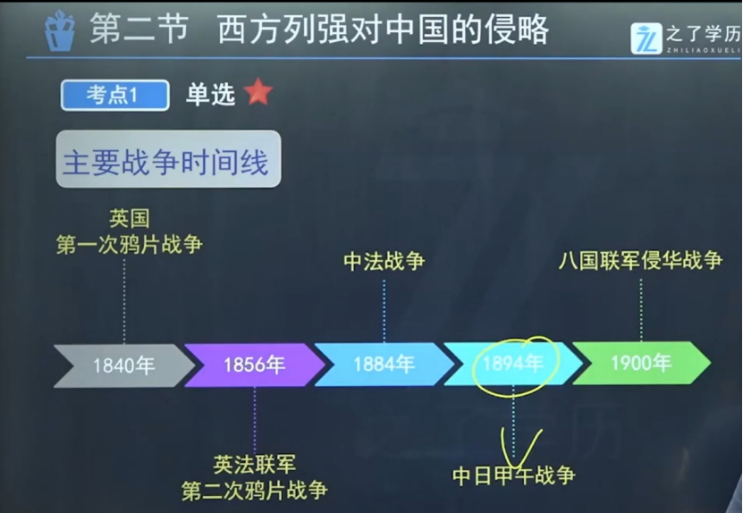 

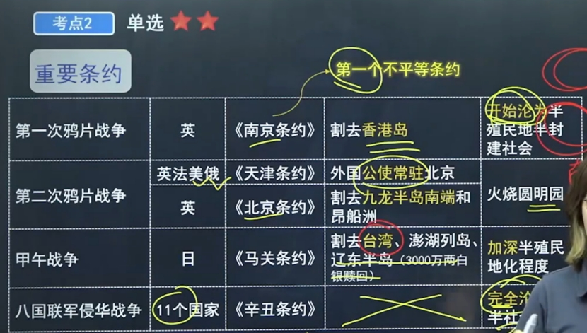
**第一次鸦片战争：1840年《南京条约》，割让香港岛****第二次鸦片战争：1856-1860年：英法《天津条约》：火烧圆明园**  
**189****5****年：中日《马关条约》：台湾、澎湖列岛****1945年回归哦****1900年：八国联军《辛丑条约》

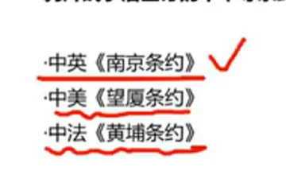 

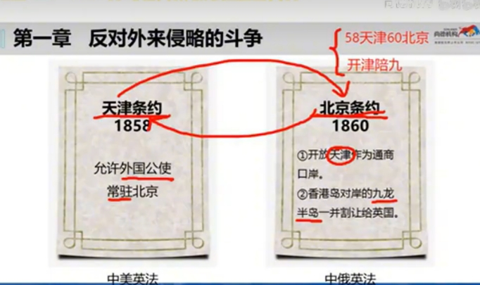 

**反抗外国武装侵略斗争**

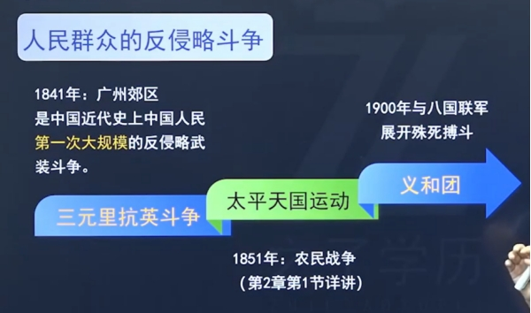   

**第一次大规模：****1841年《三元里抗英斗争》****签订了《南京条约》，割让香港岛。**

**1851年太平天国运动**
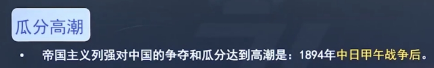  
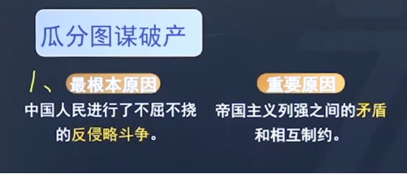
**反侵略战争的失败**
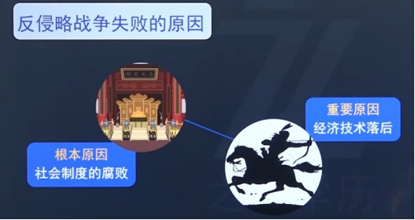

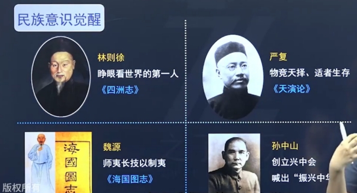  

**林则徐：睁眼看世界第一人《四洲志》****严复：《天演论》****魏源：《海国图志》****孙中山：“振兴中华”的口号**
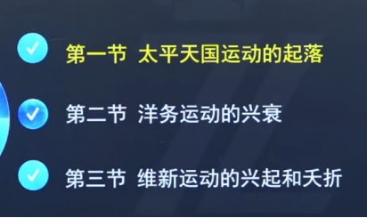  
**太平天国：1851年，洪秀全，农民阶级****洋务运动：地主阶级****维新运动：资产阶级**
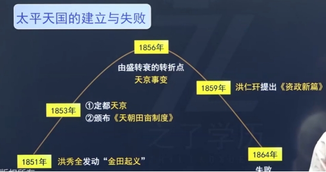  

**《****天朝田亩制度》：纲领性文件**  
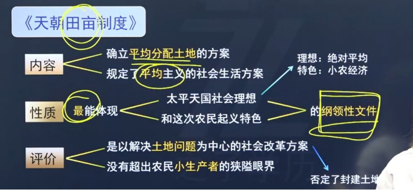  

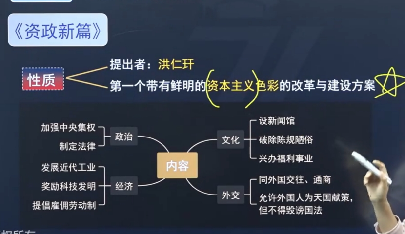  
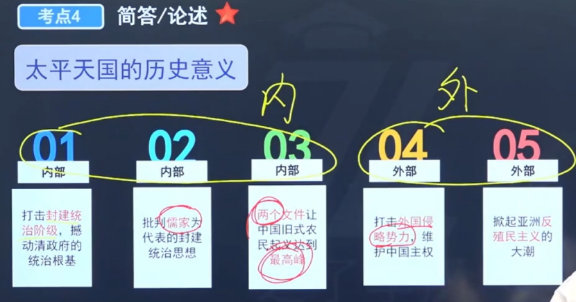  
**洋务运动**  
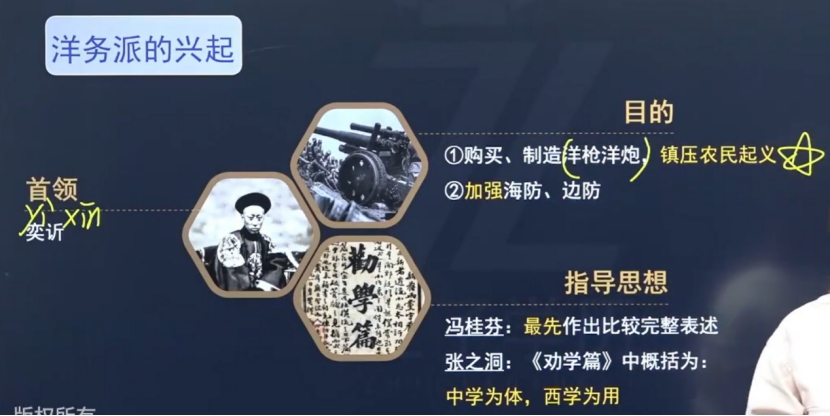  
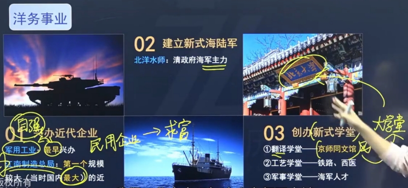  
**北洋水师：邓世昌、致远舰**  
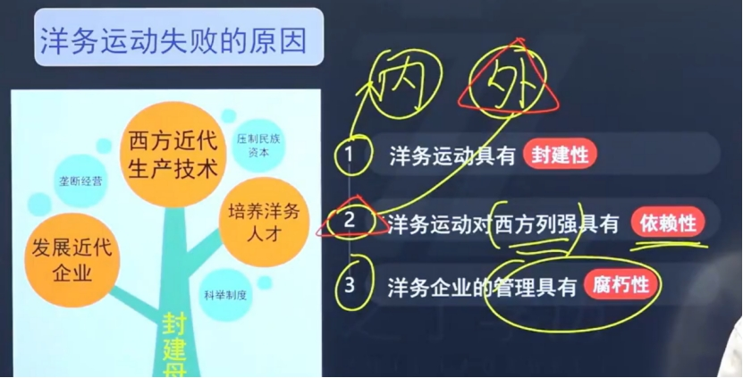